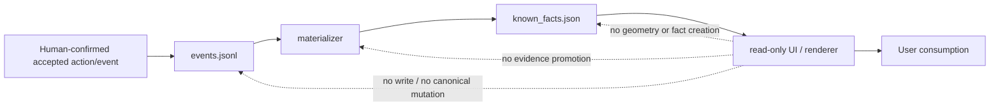
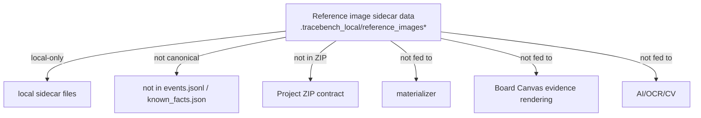

# Architecture boundaries

This diagram is orientation only; canonical repo docs win.

## Evidence boundary map (compact)

## Boundary notes

- Canonical state pointers:
  - current/next: `docs/CURRENT_STATE.md`, `docs/PASS_QUEUE.md`
  - history: `docs/AUDIT_INDEX.md`, `docs/audit/*.md`
  - durable boundaries: `docs/PROJECT_MEMORY.md`, `docs/PROTECTED_SURFACES.md`
- `events.jsonl` is canonical truth.
- `known_facts.json` is a materialized projection, not a writer.
- Renderer/UI are read-only and cannot write canonical facts.
- `visual_trace` is not a net.
- `visual_trace` cannot promote to electrical truth.
- `template_id / footprint family` is not electrical identity.
- `photo alignment` is not component identity, pin mapping, net confirmation, measurement, or fault proof.
- `board_graph.json` and `view_state.json` stay forbidden in V1/V1.1 governance surfaces.
- AI suggestions and reference images are non-factual unless a separately scoped canonical event path approves them.
