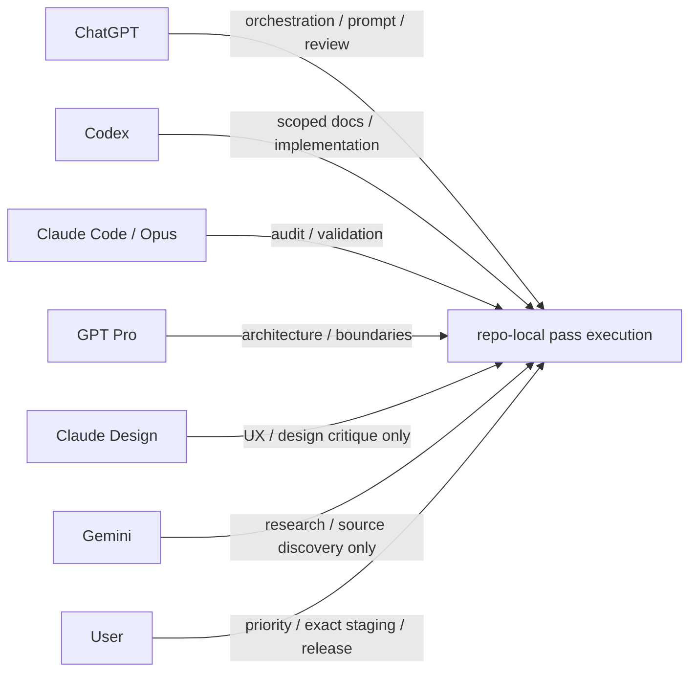

# MODEL_ROUTING.md

## Purpose

Choose the right helper/model for each pass type and risk profile.

## Model routing ownership (canonical)

`docs/MODEL_ROUTING.md` is the canonical owner for helper/model role definitions.
Prompt docs and operating docs should reference this file instead of duplicating long role blocks.

- **Codex**
  - Repo-local writer for scoped docs/code changes inside locked allowlists.
  - Local validation execution and deterministic patching.
  - Does not self-approve final acceptance for route-changing implementation/docs passes.
  - Best for `DOCS_SYNC`, scoped `FLUTTER_PASS`, `SCHEMA_PASS`, `VALIDATOR_FIX`, `TOOLS_PASS` after scope lock.

- **Claude Code**
  - Final repo-local audit gate before staging/commit/push for implementation/docs route changes unless repo convention explicitly says otherwise.
  - Repo-local audits, second-review checks, implementation-readiness checks.
  - Best for independent `AUDIT_ONLY` passes and closeout confidence.

- **ChatGPT / GPT Pro**
  - Strategy, route/risk review, prompt construction, and non-final pre-audit.
  - Best for architecture, evidence-boundary policy, high-impact sequencing, and pass-order arbitration before risky implementations.
  - Does not replace the final Claude Code repo-local audit gate where that gate is required.

- **Claude Design**
  - UX/UI/spec critique, interaction design reviews, wording structure.
  - Design review only; no repo mutation and no direct ownership of code-surface acceptance decisions.

- **Gemini**
  - Research, source discovery, and external input discovery.
  - Research/input only; no repo mutation and no acceptance-gate ownership.

- **User**
  - Product-priority choice, ownership ambiguity, or any direction change not inferable from docs.
  - Manual staging, commit, and push owner.
  - Uses exact staging sets; never broad staging (`git add .` / `git add -A`).

## Routing matrix

| Situation | Route |
|---|---|
| Narrow deterministic edit with locked scope | Codex |
| Lane A doc/polish/corrective pass | Codex first, then Claude Code |
| Lane B protected/high-risk work | ChatGPT / GPT Pro first, then Codex, then Claude Code |
| Independent repo-local compliance audit | Claude Code |
| Architecture/evidence-floor decision | ChatGPT / GPT Pro |
| Prompt construction or non-final pre-audit | ChatGPT / GPT Pro |
| UX/design/spec quality review | Claude Design |
| Research/source discovery | Gemini |
| Product priority or unresolved owner choice | User decision |

## Mandatory routing constraints

- Repo docs are source of truth over chat memory.
- If task conflicts with `ACTIVE_SCOPE_LOCK`, stop and request decision.
- If protected surfaces are implicated, route to GPT Pro or explicit user decision before implementation.
- If a docs-only pass requires non-doc edits, stop and escalate.
- Use one narrow pass at a time.
- Use exact staging sets only; never use broad staging.
- High-risk Codex implementation must receive non-Codex review before acceptance (typically Claude Code, and GPT Pro when evidence/architecture boundaries are at risk).
- V2 backend surfaces are accepted through validator -> materializer -> writer service; UI write flows remain separately scoped/audited and not yet implemented.

## Lane policy

- Lane A:
  - default for low-risk work where semantic risk is low (no protected behavior activation, no route ambiguity, no canonical write-path impact).
  - no broad scope expansion.
  - Codex executes implementation/docs pass, Claude Code handles repo-local audit.
- Lane B:
  - default for protected surfaces, canonical data surfaces, renderer write semantics, route ambiguity, or any Canonical/architecture commitment risk.
  - full prompt + GPT risk review + dedicated scope-lock + full audit sequence required.

### Lane A parent-lock / bundle mechanism

- GPT may define one parent lock covering a bounded child bundle (typically 2–4 child passes).
- Parent lock records the explicit child PASS_ID sequence and exact allowlists.
- Child passes may execute Codex → Claude directly when scope is unchanged and risk remains low.
- Parent lock must define clear escalation conditions and parent closure criteria.

Model ownership still comes from this file for all lanes; prompts remain pointer-based to keep docs authoritative.

## Practical handoff pattern

1. Codex executes scoped implementation/doc pass.
2. Claude Code runs independent audit (`PASS`, `PASS_WITH_NITS`, `NEEDS_SMALL_FIXUP`, `BLOCK`).
3. If boundary/sequence uncertainty remains, escalate to GPT Pro.
4. User resolves product-priority tie-breakers and manually stages/commits/pushes using the exact staging set.

### Tool/model routing (compact)

This diagram is orientation only; canonical repo docs win.

## Minimal handoff payload requirements

When routing to another model/helper, include:

- `PASS_ID`, `Lane`, `Mode`
- current accepted state summary
- explicit audit/review questions
- exact boundaries and forbidden surfaces
- required validation commands
- expected output format/verdict enum
- routing sequence (`who reviews what`) before execution

### No self-approval rule (high-risk paths)

- Do not finalize high-risk implementations as accepted based only on Codex/Claude-internal review.
- Explicitly route through the reviewer model(s) documented in the pass plan before closure.

## MODEL_ROUTING_CHECK convention

Every pass output should explicitly report:

- `MODEL_ROUTING_CHECK result: PASS` when route matches this policy.
- `MODEL_ROUTING_CHECK result: ESCALATED` when work is intentionally handed off.
