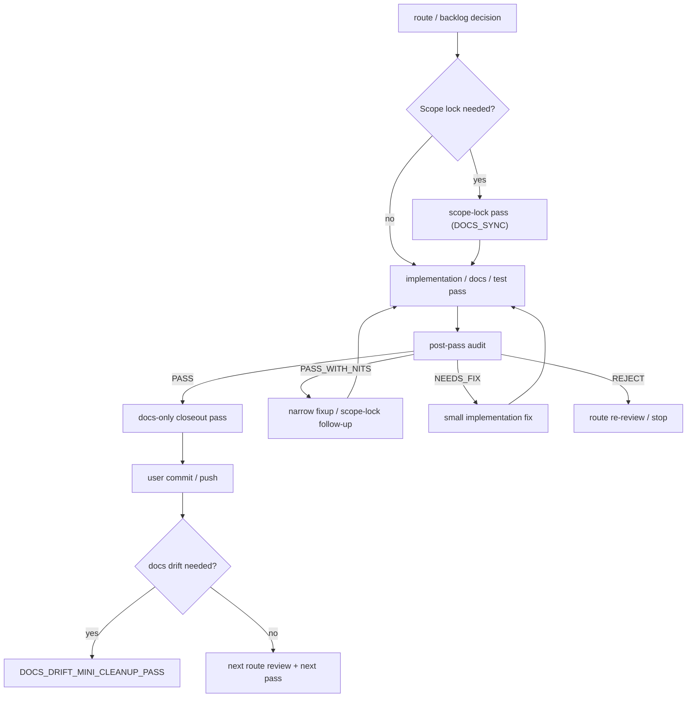
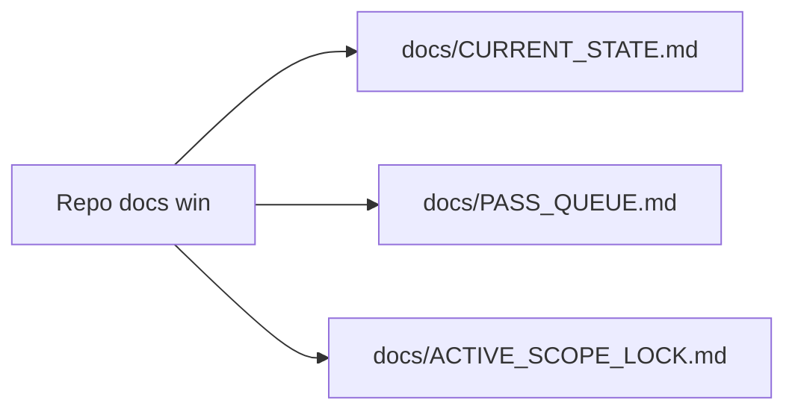
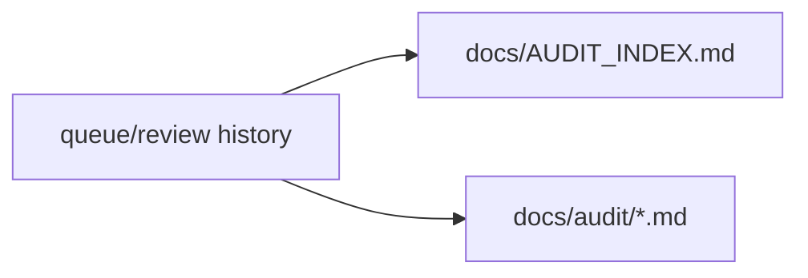

# Pass lifecycle governance

This diagram is orientation only; canonical repo docs win.
Canonical pass state remains in `docs/CURRENT_STATE.md` and `docs/PASS_QUEUE.md`.

## Pass lifecycle (compact)



## Audit-gate rules

- Every TraceBench Codex PASS_ID response ends with a clearly separated, paste-ready `CLAUDE_AUDIT_PACKET`.
- Visual/product-surface work requires manual smoke before Claude audit.
- Visual/manual-smoke packets must be marked `USE ONLY AFTER MANUAL SMOKE PASS`.
- Claude audit must not approve a known-wrong visual draft.
- `Accepted` shorthand is valid only for clean `ACCEPT_AS_IS`, `SAFE_FOR_STAGING: YES`, no blockers, and an exact expected staging set.
- Any nit, blocker, route/hash mismatch, unexpected file, protected-surface concern, or unclear staging set requires the relevant Claude audit details.
- Staging must be exact-file staging only; never `git add .`, never `git add -A`, and never broad-stage.

## Protected implementation active-lock sync

After a protected scope-lock is accepted/pushed, implementation may begin only when `docs/ACTIVE_SCOPE_LOCK.md` names the implementation pass and lists the exact runtime/test write allowlist.

If the active lock still names the docs-only scope-lock or does not list the runtime/test allowlist, route first to:

```text
<IMPLEMENTATION_PASS>_ACTIVE_LOCK_SYNC_PASS
```

That active-lock sync pass is docs-only and must not implement runtime behavior.




