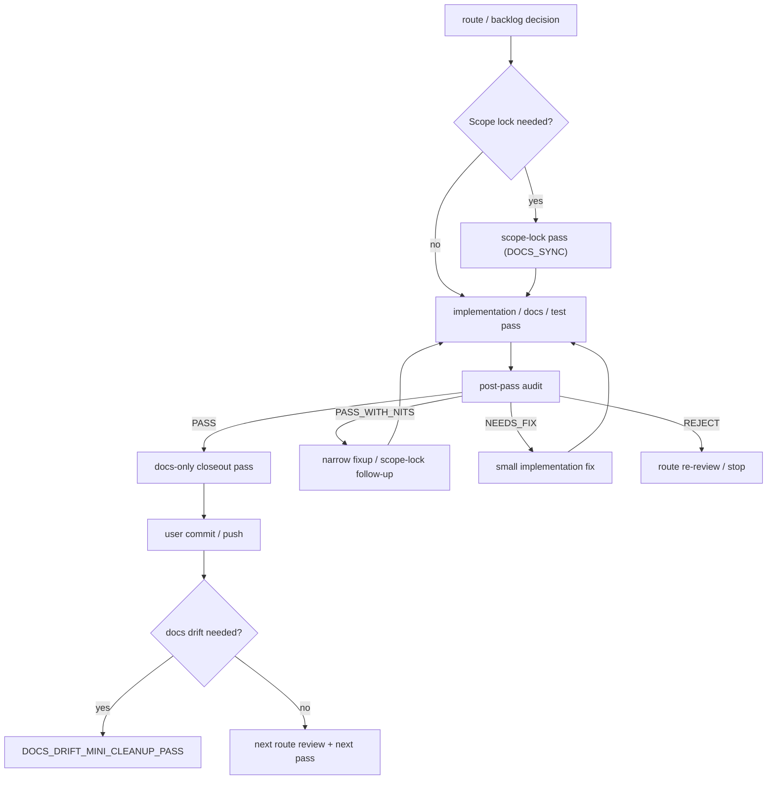
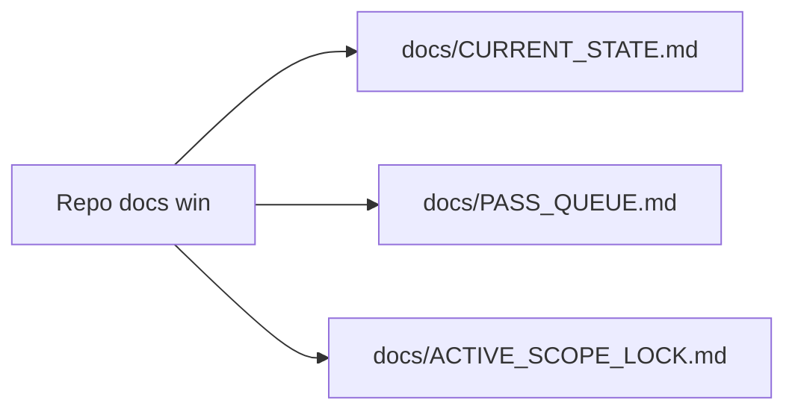
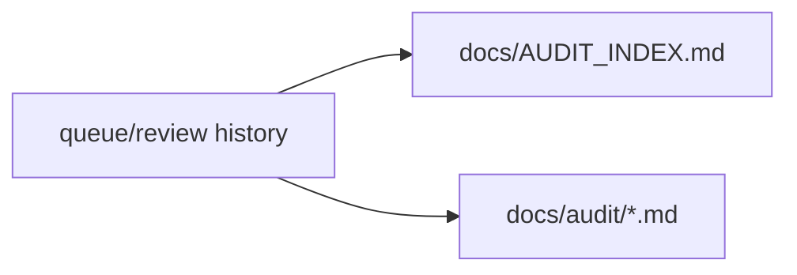

# Pass lifecycle governance

This diagram is orientation only; canonical repo docs win.
Canonical pass state remains in `docs/CURRENT_STATE.md` and `docs/PASS_QUEUE.md`.

## Pass lifecycle (compact)

