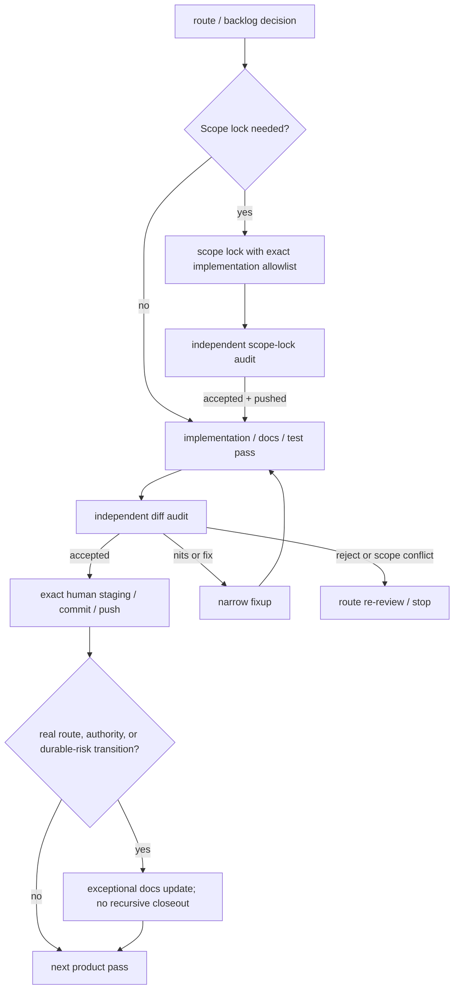
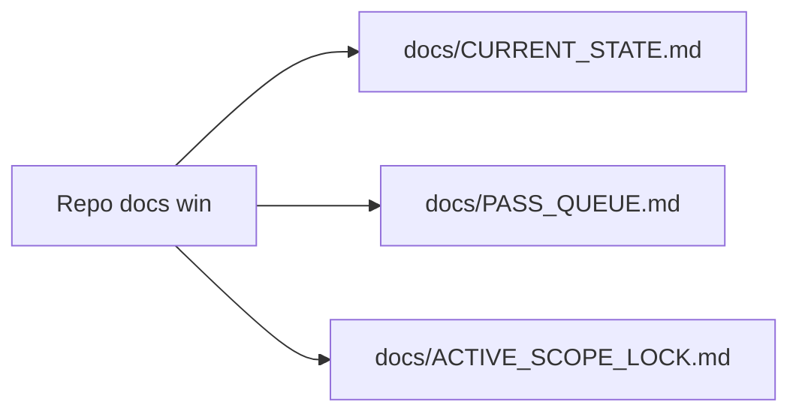
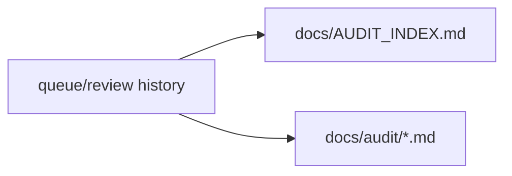

# Pass lifecycle governance

This diagram is orientation only; canonical repo docs win.
Canonical pass state remains in `docs/CURRENT_STATE.md` and `docs/PASS_QUEUE.md`.

## Pass lifecycle (compact)

## Audit-gate rules

- A Codex response hands off a `CLAUDE_AUDIT_PACKET` only after actual repository
  changes exist for independent audit. `docs/PROMPTING_PROTOCOL.md` owns packet
  timing and `docs/AUDIT_CONTRACT.md` owns its exact shape.
- Visual/product-surface work requires manual smoke before Claude audit.
- Visual/manual-smoke packets must be marked `USE ONLY AFTER MANUAL SMOKE PASS`.
- Claude audit must not approve a known-wrong visual draft.
- `Accepted` shorthand is valid only for clean `ACCEPT_AS_IS`, `SAFE_FOR_STAGING: YES`, no blockers, and an exact expected staging set.
- Any nit, blocker, route/hash mismatch, unexpected file, protected-surface concern, or unclear staging set requires the relevant Claude audit details.
- Staging must be exact-file staging only; never `git add .`, never `git add -A`, and never broad-stage.
- Do not create a new PASS_ID merely to copy an audit verdict. A meaningful
  route/authority/risk update may use an exceptional docs action, but it does
  not create another routine closeout or audit-of-audit loop.

## Protected implementation activation

A protected scope-lock draft must already name the future implementation
PASS_ID and exact runtime/test write allowlist. That implementation authority is
conditional until the scope-lock diff is independently accepted and its exact
commit is pushed; after those gates, implementation may proceed without a
routine active-lock-sync pass. If an older or deficient lock lacks either the
PASS_ID or allowlist, stop and amend the lock instead of inventing a sync pass.
Protected-surface review and independent audit remain mandatory.

