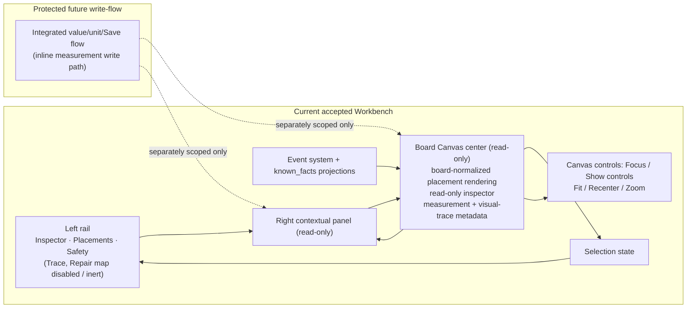

# PROJECT_MEMORY.md

Canonical product and architecture memory for TraceBench / BenchBeep.

## Product identity

Durable owner for product/project/subsystem naming:

- `BenchBeep` is the user-facing app/product name.
- `TraceBench` is the repository/platform/project name.
- `BoardFact` is the data-fact/subsystem name.
- `BoardFact` is not the primary app wordmark unless a specific UI surface explicitly earns that subsystem label.

## Product promise

Measurement-backed PCB repair documentation and AI-assisted schematic reconstruction.

## Placement editor architecture decision

Accepted scope-lock owner: `BOARD_CANVAS_PLACEMENT_EDITOR_ARCHITECTURE_DECISION_SCOPE_LOCK_PASS`.

- Add Component remains the human-entered identity/existence writer and creates `component_created` only.
- `component_created` does not confirm board position, board side, rotation, size, shape, visual contacts, pads, legs, pins, nets, or measurements.
- Board Canvas renderer/painter remains bodyOnly/read-only: `renderer writes: none`.
- Board Canvas local builder/ghost/template state is UI-local draft only unless explicit human `Salvesta` confirms visual placement through the dedicated placement writer.
- The accepted placement editor surface is the Board Canvas right-panel / `Lisa komponent` draft area; do not create a standalone placement editor screen first unless a later scope overturns this decision.
- Explicit Confirm/Salvesta calls the dedicated placement writer service; painter/renderer code does not write events.
- The V2 placement regime is `schema_version: 2.0-draft`, `actor.type: human`, source block, `confirmation.confirmed: true`, and idempotent `client_operation_id` precedent where applicable.
- Do not build a new V1 placement writer using `actor.type = user` plus `sequence` / `status`.
- Confirmed visual placement size uses `width` + `height` as the primary visual envelope; `scale` is import/backward compatibility only unless later scoped.
- VectorFootprintLibrary / footprint recipe model owns canonical visual vocabulary; Board Canvas starter templates are UI presets only.
- Visual contact layout is separate future event/projection scope and must not be folded into `component_visual_placement_confirmed`.
- Visual contact confirmation is not electrical confirmation.
- AI marker conversion remains future scope: AI marker is an unconfirmed proposal/sidecar/UI-local candidate until human confirmation converts it through the placement editor path. AI never authors canonical placement events.

Accepted placement writer and save chain:

- `PLACEMENT_WRITER_AND_CONFIRM_IMPL_PASS` added `lib/features/components/services/v2_placement_writer.dart` and explicit selected-component Board Canvas `Salvesta`.
- The writer emits exactly one canonical event type: `component_visual_placement_confirmed`.
- Confirm/Salvesta writes only after explicit user action; all draft interactions remain UI-local/no-write.
- The writer uses V2/human envelope semantics with explicit user confirmation, `client_operation_id`, and width plus height as the primary visual envelope size model.
- Placement save does not create component identity and does not write contacts, pins, pads, nets, traces, measurements, electrical facts, AI facts, repair conclusions, or visual contact layout.
- `PROJECT_OPEN_FROM_DIRECTORY_IMPL_PASS` added a local-folder open path through `ProjectLoader.loadFromDirectory`, preserving `projectDirectory` for writer-backed local projects.
- `PLACEMENT_ROTATION_NORMALIZATION_IMPL_PASS` normalizes canonical `rotation_deg` to `-180 <= rotation_deg < 180` before emit.
- `PLACEMENT_SAVE_PROJECTION_STALE_IMPL_PASS` makes successful save truthfully show projection refresh/stale state; `known_facts.json` remains projection/cache and is not directly mutated by Flutter.
- `BOARD_CANVAS_EXPLICIT_WRITE_STATUS_COPY_IMPL_PASS` updates status copy to distinguish renderer/painter read-only from explicit panel save write capability.
- `PLACEMENT_DRAFT_CANONICAL_BOUNDS_GUARD_IMPL_PASS` guards invalid `board_normalized` draft bounds before writer call.

Accepted Add Component panel draft controls:

- `ADD_COMPONENT_PANEL_LOCAL_DRAFT_CONTROLS_SCOPE_LOCK_PASS` consumed the exact design handoff `C:\Users\Kasutaja\Desktop\TraceBench\_incoming\ui_redesign\Components\Lisa_Komponent_Panel_Codex_Handoff.html` as `DESIGN_INPUT_ONLY`.
- `_incoming` remains provenance/design input only and must not be staged or imported into runtime.
- Shape/package, marker layout, size, rotation, draft preview, and safety copy are UI-local draft controls until explicit save.
- `Muuda` is not an active no-op, `Kustuta` discards local draft only, and `Tühista` must not imply a canonical write.
- Pin/contact controls remain visual marker drafts only and do not confirm contacts, pads, pins, nets, traces, measurements, or electrical facts.

## Core rule

Human is the sensor. AI is the graph engine.
AI must never invent component identities, hidden-layer connections, measurements, or confirmed facts.

## V1.0 scope

`pildista → märgi → mõõda → kinnita → ekspordi`

V1.0 is a Known Facts Builder, not an AI repair agent.

## Technician-first workflow invariant

BenchBeep should be a technician-first bench workflow, not an engineering spreadsheet.

- Default workflow: select place/component/pin -> measure -> enter value -> choose unit -> save -> show status / next step.
- Short form: `Koht -> Väärtus -> Ühik -> Salvesta`.
- Default UI must be measure-first, not form-first; keep ordinary visible fields small and put internal/provenance/schema details behind progressive disclosure.
- Repair technicians should not need to understand canonical schemas, event IDs, projection state, sidecar semantics, or internal graph rules during normal use.
- Human local measurements must visually outrank research/reference/candidate values; reference/research/candidate values must not look measured.
- AI/helper may suggest next measurements, organize accepted context, surface gaps/conflicts, and summarize confirmed facts, but must not create canonical facts, diagnose faults, infer nets, confirm identity, or make probability-style fault claims.
- User-visible activity timeline, if later implemented, must be compact/toggleable, non-dominant, non-canonical, and separate from both `events.jsonl` and debug logs.
- Future post-save momentum may show confirmation, retain selected `Koht`, and suggest a next pin/point only as workflow aid after V2 event-writing architecture unlocks real save behavior.
- Production core UI must remain local/offline-capable; prototype external resources such as Google Fonts are visual input only and must not become mandatory dependencies.
- Prototype `localStorage` persistence is demo-only; production persistence requires accepted event-writing architecture.
- Primary quick measurement units remain V / Ω / Diode / Beep by default; A/current measurement belongs behind `Lisainfo` / `Tehnilised detailid` / advanced affordance unless separately scoped.
- Preferred technician-facing Estonian labels include `Koht`, `Väärtus`, `Ühik`, `Mõõdetud siin`, `Võrdluseks`, `Vihje`, `Kinnitamata`, and `Ainult kandidaat`; avoid schema/event/debug jargon and inference/diagnostic wording.

## Stable architecture invariants

- `events.jsonl` is the only canonical truth.
- Accepted events are canonical source for current domain facts.
- Non-accepted events are audit/history/review evidence and must not silently become current domain facts.
- `known_facts.json` is a materialized projection used by read-only viewers.
- Footprint template registry is app/library metadata only and is not canonical project fact storage.
- `template_id` is package/geometry metadata only and is not component identity, electrical function, pin-mapping confirmation, measured-net proof, or fault evidence.
- `component_visual_placement_confirmed` is a canonical visual/documentation placement event and does not confirm identity, pin mapping, visual trace, electrical net, measurement, fault candidate, repair conclusion, or hidden-layer truth.
- `known_facts.json` may include top-level `component_visual_placements` as visual/documentation projection only.
- AI proposal objects (`unconfirmed_ai_proposal`) are non-canonical until explicit human confirmation through accepted event paths.
- `graph_layout` is non-canonical render state.
- `board_graph.json` and `view_state.json` remain forbidden across V1/V1.1/V2 unless separately scoped.
- Board-canvas renderer is read-only and implemented with shell, `board_normalized` component placement rendering, read-only inspector, measurement summary metadata, visual_trace metadata summary, and photo-alignment readiness metadata panel. Visual/evidence canvas geometry overlay rendering remains deferred.
- Visual evidence is visual-only; `visual_trace` is never measured electrical evidence.
- `component_removed` event type is not in V1.
- `repair_action_recorded(action_type="remove_component")` is the V1 removal model.
- External AI Component Reading Simulation Lab is outside this repository and not part of TraceBench canonical truth surfaces.

## Accepted Workbench architecture (current route)

- The accepted Workbench/measurement-overlay model is read-only here; this line does not describe the separately scoped Board Canvas placement `Salvesta` path.
- `renderer writes: none` is an active renderer/painter constraint; explicit panel save writes only through the dedicated placement writer service.
- `Trace` and `Repair map` are currently visible as UI affordances but disabled/inert.
- Empty-canvas tap is read-only state behavior only (clear local selection/panel state).
- `/project/measure-sheet` and inline value/unit/Save work are future/protected and must be implemented only through separate accepted write-flow passes.

## Non-negotiables

- local-first
- append-only event log
- Visual/Layout Graph separate from Electrical Net Graph
- evidence floor rule
- no hard onboarding gates
- project can start with unknown device/model/symptom and no photos
- `not_populated` is first-class
- `stale_after_repair` preserves old measurements
- Project ZIP must be self-contained

## Accepted state pointer

Current accepted snapshot lives in [docs/CURRENT_STATE.md](CURRENT_STATE.md).

Full pass history and evidence live in [docs/PASS_QUEUE.md](PASS_QUEUE.md) and `docs/audit/**/*.md`.
- V2 event-writing architecture, schema/spec, validator, materializer, writer service, and Save Measurement UI write-flow are accepted through separately scoped/audited passes; other UI write flows remain blocked until separately scoped/audited, and canonical writes remain human-authored append-only events.

## Placement event V2 regime

`BOARD_CANVAS_PLACEMENT_EVENT_V2_REGIME_SCOPE_LOCK_PASS` locked the `component_visual_placement_confirmed` migration direction that is now implemented through validator/materializer support and the dedicated placement writer path.

Stable decisions:

- Placement events align to the V2/human regime: `schema_version: 2.0-draft`, `actor.type: human`, source block, `confirmation.confirmed: true`, and `client_operation_id` / idempotency precedent where applicable.
- Do not build a new V1 placement writer using `actor.type = user` plus `sequence` / `status`.
- Validator/materializer are V2-capable for human-authored `component_visual_placement_confirmed`; `schemas/events.schema.json` remains V1-envelope-only by design/current state.
- Materializer does not silently drop V2 human-authored placement events.
- `component_visual_placement_confirmed` represents visual placement envelope data only: component, board side, coordinate space, center position, rotation, width/height, optional template/family reference, and human confirmation metadata.
- It does not represent electrical connectivity, net identity, measurement pin identity, confirmed contact layout, AI-authored facts, or visual contact/pad layout.
- Visual contact layout remains separate future scope; AI/photo markers remain unconfirmed until human conversion.
- Board Canvas renderer remains bodyOnly/read-only: `renderer writes: none`.

## Placement projection ordering and invalidation scope lock

`PLACEMENT_PROJECTION_ORDER_AND_INVALIDATION_SCOPE_LOCK_PASS` locks projection semantics for visual placements; it remains separate from edit-placement UI, visual-contact layout, and AI marker conversion.

Stable decisions:

- Legacy V1 placement events remain first-class legacy events.
- `component_visual_placements` latest-wins must interleave V1 and V2 placement confirmations deterministically by `events.jsonl` stream order, not by V1 `sequence` alone.
- A later valid accepted/human-confirmed placement event supersedes an earlier placement for the same component.
- `event_invalidated` retracts the targeted placement event from `component_visual_placements`.
- If the newest placement is invalidated, projection falls back to the newest remaining valid placement for that component, or removes the projected placement if none remains.
- Placement correction remains append-only through newer `component_visual_placement_confirmed` events.
- Do not introduce a placement-updated event type for this fix.
- Placement projection must not absorb contact layout, electrical connectivity, pin identity, net identity, AI-authored facts, pads, contacts, or visual-contact layout.
- Future implementation is expected to be materializer + materializer tests only unless active-lock sync proves validator behavior must change.

## Legacy/current surface classification

Owner pass: `LEGACY_SURFACE_CLASSIFICATION_DOCS_PASS`.

This is a docs-only classification snapshot. It authorizes no route hiding, screen deletion, runtime changes, test edits, UI rename, staging, commit, or push. Any cleanup must happen through later small passes: docs labeling, route hiding/debug-only scope, test migration, and removal only after replacement/proof.

Classification labels used here:

- `KEEP_CURRENT`: current product/lifecycle surface; keep available.
- `KEEP_BUT_RESKIN_LATER`: useful/current but visual or information architecture polish can happen later.
- `KEEP_AS_TEST_OR_DEBUG_ONLY`: retain for advanced/debug/test visibility until V2 inspectors cover the same information.
- `TRANSITIONAL_REPLACE_LATER`: still reachable or useful, but future routing/product work should replace or consolidate it.
- `CANDIDATE_FOR_RETIREMENT`: only removable after a later scoped pass proves no route/test/user dependency and names the replacement.
- `UNKNOWN_NEEDS_DECISION`: insufficient evidence; requires human product decision before changing route visibility.

Canonical write capability values: `none`, `UI-local only`, `canonical writer`, `projection/debug only`, `export/materialization path`.

| Surface / flow | File path(s) | Route/path | How user reaches it | Current role | Classification | Canonical write capability | Tests known | Recommendation |
|---|---|---|---|---|---|---|---|---|
| BenchBeep launcher / app start | `lib/app/app.dart`; `lib/features/home/screens/benchbeep_home_screen.dart` | App launcher before workbench router | App start | Current product entry for sample, ZIP import, open local folder, and workbench launch | `KEEP_CURRENT` | `none` | `test/widget/benchbeep_home_screen_test.dart` | Keep as primary launcher. Future visual polish must preserve local-folder open behavior and sample/ZIP distinctions. |
| Legacy/root project home | `lib/features/project/screens/home_screen.dart`; `lib/app/router.dart` | `/` inside workbench router | Router root/fallback and tests | Older project action hub with sample/import/open/new-project actions | `TRANSITIONAL_REPLACE_LATER` | `none` | Not verified by dedicated filename in this pass | Keep until launcher/router ownership is consolidated. Do not delete without proving no root-route dependency. |
| New project wizard | `lib/features/project/screens/new_project_wizard_screen.dart` | `/new-project` | Launcher/root project actions | Creates a new local TraceBench project folder through the project creator flow | `KEEP_BUT_RESKIN_LATER` | `export/materialization path` | `test/widget/new_project_wizard_screen_test.dart`; `test/unit/project_creator_test.dart` | Keep as lifecycle-critical. Reskin later rather than retire. |
| Project Overview / Workbench shell | `lib/features/project/screens/project_overview_screen.dart` | `/project` | Loaded project workbench | Navigation shell and workbench overview | `KEEP_CURRENT` | `none` | `test/widget/project_overview_screen_test.dart` | Keep. It remains the project navigation bridge even while Board Canvas is the default workbench target. |
| Board Canvas | `lib/features/board_canvas/screens/board_canvas_screen.dart` | `/project/board-canvas` | Workbench default and overview Board Canvas action | Primary visual board surface; renderer/painter read-only; scoped panel actions can write placement events | `KEEP_CURRENT` | `canonical writer` | `test/widget/board_canvas_screen_test.dart` | Keep as primary board workspace. Preserve distinction: renderer/painter write nothing; explicit `Salvesta` may write `component_visual_placement_confirmed`. |
| Board Graph | `lib/features/board_graph/screens/board_graph_screen.dart` | `/project/graph` | Overview Board Graph action | Projection/graph exploration and advanced debugging | `KEEP_AS_TEST_OR_DEBUG_ONLY` | `projection/debug only` | `test/widget/board_graph_screen_test.dart` | Keep available as advanced/debug surface. It is not a replacement for Board Canvas. |
| Add Component standalone page | `lib/features/components/screens/add_component_screen.dart` | `/project/components/add` | Overview Add Component action | Creates component identity through explicit human `component_created` writer | `KEEP_BUT_RESKIN_LATER` | `canonical writer` | `test/widget/add_component_screen_test.dart`; V2 add-component writer tests | Keep until component-identity creation has a proven V2 replacement. Do not confuse this with Board Canvas `Lisa`, which confirms placement for an existing component only. |
| Edit Component standalone page | `lib/features/components/screens/edit_component_screen.dart` | `/project/components/edit` | Overview Edit Component action | Updates component metadata through explicit human `component_updated` writer | `KEEP_BUT_RESKIN_LATER` | `canonical writer` | `test/widget/edit_component_screen_test.dart`; V2 edit-component writer tests | Keep until a replacement edit flow exists and tests migrate. |
| Measure Sheet | `lib/features/measure_sheet/screens/measure_sheet_screen.dart` | `/project/measure-sheet` | Overview measurement actions and redirect from `/project/measurements/new` | Current canonical measurement writer surface | `KEEP_CURRENT` | `canonical writer` | `test/widget/measure_sheet_screen_test.dart`; V2 save-measurement writer tests | Keep as current measurement write owner until Board Canvas measurement writer is separately scoped. |
| Measurement list | `lib/features/measurements/screens/measurement_list_screen.dart` | `/project/measurements` | Overview list action | Projection/list view of recorded measurements | `KEEP_AS_TEST_OR_DEBUG_ONLY` | `projection/debug only` | `test/widget/measurement_list_screen_test.dart` | Keep for debug/advanced visibility until V2 inspectors cover the same data. |
| Component list | `lib/features/components/screens/component_list_screen.dart` | `/project/components` | Overview list action | Projection/list view of components | `KEEP_AS_TEST_OR_DEBUG_ONLY` | `projection/debug only` | Direct widget test not verified by filename in this pass | Keep as advanced/debug list until a replacement inspector covers it. |
| Pin list | `lib/features/pins/screens/pin_list_screen.dart` | `/project/pins` | Overview list action | Projection/list view of pins | `KEEP_AS_TEST_OR_DEBUG_ONLY` | `projection/debug only` | Direct widget test not verified by filename in this pass | Keep as advanced/debug list. Do not treat as placement/contact confirmation UI. |
| Not populated list | `lib/features/not_populated/screens/not_populated_screen.dart` | `/project/not-populated` | Overview list action | Projection/list view for not-populated component facts | `KEEP_AS_TEST_OR_DEBUG_ONLY` | `projection/debug only` | `test/widget/not_populated_screen_test.dart` | Keep for debug/advanced visibility until V2 inspectors cover it. |
| Events viewer | `lib/features/events/screens/events_viewer_screen.dart` | `/project/events` | Overview debug/list action | Raw canonical event inspection | `KEEP_AS_TEST_OR_DEBUG_ONLY` | `projection/debug only` | `test/widget/events_viewer_advanced_screen_test.dart`; `test/widget/events_viewer_beginner_screen_test.dart` | Keep as advanced/debug. Raw events remain useful until friendlier V2 inspectors replace the need. |
| Known facts JSON viewer | `lib/features/known_facts/screens/known_facts_viewer_screen.dart` | `/project/known-facts` | Overview debug/list action | Raw projection/cache inspection | `KEEP_AS_TEST_OR_DEBUG_ONLY` | `projection/debug only` | Direct widget test not verified by filename in this pass | Keep as advanced/debug. It must not imply `known_facts.json` is canonical truth. |
| Photos | `lib/features/photos/screens/photo_list_screen.dart` | `/project/photos` | Overview Photos action | Photo/evidence browsing from project state | `KEEP_BUT_RESKIN_LATER` | `projection/debug only` | `test/widget/photo_list_screen_test.dart` | Keep. Future polish can improve evidence workflow, but this pass authorizes no semantic change. |
| Reference Images | `lib/features/reference_images/screens/reference_images_screen.dart` | `/project/reference-images` | Overview Reference Images action | Local sidecar/reference image management, not canonical evidence | `KEEP_BUT_RESKIN_LATER` | `UI-local only` | `test/widget/reference_images_screen_test.dart` | Keep as local reference sidecar. Do not promote to canonical evidence without a protected scope. |
| Customer report / export | `lib/features/report/screens/customer_report_screen.dart`; project exporter services | `/project/report` | Overview report/export action | Critical customer report and ZIP/export lifecycle | `KEEP_CURRENT` | `export/materialization path` | `test/widget/customer_report_screen_test.dart`; project exporter tests | Keep. Export/Project ZIP behavior is protected and needs dedicated scope for changes. |
| `/project/measurements/new` redirect | `lib/app/router.dart` | `/project/measurements/new` redirects to `/project/measure-sheet` | Legacy/deep-link compatibility | Keeps older measurement-entry route landing on current Measure Sheet | `KEEP_CURRENT` | `none` | Covered by route/overview expectations where present | Keep compatibility redirect until usage is proven gone in a later route cleanup pass. |
| Sample/demo project surfaces | `lib/app/app.dart`; `lib/features/home/screens/benchbeep_home_screen.dart`; project loader/sample assets | Launcher sample/open actions | Launcher buttons | Read-only/demo baseline for smoke and onboarding | `KEEP_CURRENT` | `none` | `test/widget/benchbeep_home_screen_test.dart`; sample validation paths | Keep. Sample/assets behavior must remain distinct from folder-backed writable projects. |
| Import/open/export lifecycle surfaces | `lib/app/app.dart`; `lib/features/project/screens/home_screen.dart`; `lib/features/report/screens/customer_report_screen.dart`; project loader/import/export services | Launcher/root/report flows | Launcher/root/report actions | Local folder open, ZIP import, and customer/project export lifecycle | `KEEP_CURRENT` | `export/materialization path` | BenchBeep home, ZIP loader, directory-open, and exporter tests where present | Keep. Changes are lifecycle/protected-adjacent and need scoped passes. |
| Legacy measurement record screen, unrouted | `lib/features/measurements/screens/measurement_record_screen.dart` | No route found in `lib/app/router.dart` during this pass | Direct widget tests only, not current router navigation | Older measurement write UI using the legacy measurement event writer | `CANDIDATE_FOR_RETIREMENT` | `canonical writer` | `test/widget/measurement_write_screen_test.dart`; legacy measurement writer tests | Candidate only after a later pass proves no route/user dependency and migrates or preserves required tests. Measure Sheet remains the current routed measurement writer. |

Additional notes:

- No current routed surface is classified `UNKNOWN_NEEDS_DECISION` in this pass.
- No requested minimum surface is authorized for deletion or hiding by this classification.
- Standalone Add Component creates component identity with `component_created`; Board Canvas `Lisa` confirms visual placement for an already selected existing component.
- Standalone Edit Component updates metadata with `component_updated`.
- Measure Sheet remains the current canonical measurement writer until a Board Canvas measurement writer is separately scoped.
- Board Graph and raw list/viewer screens are projection/debug/advanced surfaces, not replacements for Board Canvas.
- Reference Images are local sidecar/reference only, not canonical evidence.
- Customer report/export remains critical lifecycle behavior.
- Cleanup candidates should proceed by small future passes, likely `BOARD_GRAPH_LEGACY_ROUTE_SCOPE_LOCK_PASS`, `ADD_EDIT_COMPONENT_LEGACY_FLOW_REVIEW_PASS`, and `MEASURE_SHEET_V2_ALIGNMENT_SCOPE_LOCK_PASS`.

## Board Graph legacy route scope lock

Owner pass: `BOARD_GRAPH_LEGACY_ROUTE_SCOPE_LOCK_PASS`.

Locked product decision:

- Board Canvas is the primary technician-facing board/workbench surface.
- Board Graph is an advanced/debug/projection inspection surface, not the primary placement/write/edit workflow.
- Board Graph must not create canonical facts.
- Board Graph may remain reachable from current navigation until a later implementation pass explicitly hides, moves, or relabels it.
- No deletion or route hiding is authorized by the scope-lock.

Read-only findings recorded for this lock:

- Router exposes Board Graph at `/project/graph` through `BoardGraphScreen`.
- Project Overview / Workbench currently exposes a Board Graph action beside Board Canvas-related actions.
- `BoardGraphScreen` consumes projected graph/state data for inspection and has no scoped canonical writer role.
- `test/widget/board_graph_screen_test.dart` is the direct Board Graph widget-test surface to preserve or migrate before route hiding.

Future wording direction:

- Use wording equivalent to `Advanced graph view`, `Projection graph`, or `Debug graph` to distinguish it from `Board Canvas`.
- Avoid presenting Board Graph as a peer primary technician workflow next to Board Canvas unless a later product decision reclassifies it.

Future implementation constraints:

- Do not delete Board Graph in one step.
- Do not remove tests without migration.
- Do not change Board Canvas behavior.
- Do not change writer/schema/events/known_facts behavior.
- Do not create or mutate canonical facts.
- Do not alter projection/materializer semantics.
