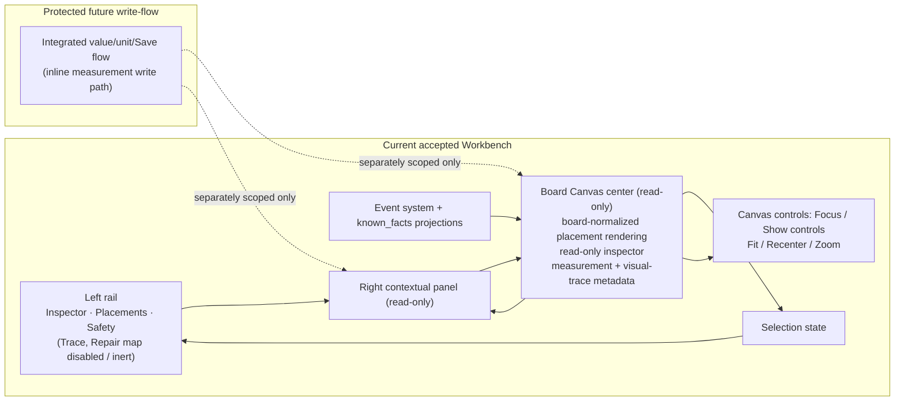

# PROJECT_MEMORY.md

Canonical product and architecture memory for TraceBench / BenchBeep.

## Product identity

Durable owner for product/project/subsystem naming:

- `BenchBeep` is the user-facing app/product name.
- `TraceBench` is the repository/platform/project name.
- `BoardFact` is the data-fact/subsystem name.
- `BoardFact` is not the primary app wordmark unless a specific UI surface explicitly earns that subsystem label.

## Product promise

Measurement-backed PCB repair documentation and AI-assisted schematic reconstruction.

## Placement editor architecture decision

Accepted scope-lock owner: `BOARD_CANVAS_PLACEMENT_EDITOR_ARCHITECTURE_DECISION_SCOPE_LOCK_PASS`.

- Add Component remains the human-entered identity/existence writer and creates `component_created` only.
- `component_created` does not confirm board position, board side, rotation, size, shape, visual contacts, pads, legs, pins, nets, or measurements.
- Board Canvas remains bodyOnly/read-only until separately scoped: `renderer writes: none`.
- Board Canvas local builder/ghost/template state is UI-local draft only and is not canonical placement/contact proof.
- Future placement editor ownership starts by evolving the Board Canvas right-panel / ghost draft into the official UI-local placement editor.
- Do not create a standalone placement editor screen first unless a later scope overturns this decision.
- Future Confirm calls a dedicated placement writer service; painter/renderer code does not write events.
- `component_visual_placement_confirmed` must be aligned to the V2 event regime before Dart writer or Confirm UI implementation.
- The V2 placement regime decision is `schema_version: 2.0-draft`, `actor.type: human`, source block, `confirmation.confirmed: true`, and idempotent `client_operation_id` precedent where applicable.
- Do not build a new V1 placement writer using `actor.type = user` plus `sequence` / `status`.
- Confirmed visual placement size uses `width` + `height` as the primary visual envelope; `scale` is import/backward compatibility only unless later scoped.
- VectorFootprintLibrary / footprint recipe model owns canonical visual vocabulary; Board Canvas starter templates are UI presets only.
- Visual contact layout is separate future event/projection scope and must not be folded into `component_visual_placement_confirmed`.
- Visual contact confirmation is not electrical confirmation.
- AI marker conversion remains future scope: AI marker is an unconfirmed proposal/sidecar/UI-local candidate until human confirmation converts it through the placement editor path. AI never authors canonical placement events.

Additional protected scope-lock: `PLACEMENT_EDITOR_AND_WRITER_SCOPE_LOCK_PASS`.

- Board Canvas right-panel / ghost draft area owns the first official placement editor surface.
- First implementation slice is UI-local placement editor shell only; no writer and no canonical writes.
- Draft state is in-memory/session-only until explicit human Confirm; cancel, discard, leaving the editor, and ordinary draft edits must not write.
- Placement editor may edit board side, template/shape family, center position, rotation, width, height, optional template/visual family reference, and optional notes.
- Per-side contact counts may be draft-only visual controls until a separate visual-contact layout scope; they must not be persisted as contacts or placement payload.
- Future dedicated writer emits exactly one V2 event type: `component_visual_placement_confirmed` with human actor, explicit user confirmation source, confirmed confirmation block, idempotent client operation precedent, and width/height envelope payload.
- The writer must use the canonical append path and must not directly edit `known_facts.json`, create component identity, update component metadata, or write nets, pins, pads, contacts, measurements, AI facts, repair conclusions, or visual contact layout.
- Edit placement reuses the same editor, pre-seeded from projection, and re-confirms by appending a newer placement event; no placement-updated event type is introduced.

## Core rule

Human is the sensor. AI is the graph engine.
AI must never invent component identities, hidden-layer connections, measurements, or confirmed facts.

## V1.0 scope

`pildista → märgi → mõõda → kinnita → ekspordi`

V1.0 is a Known Facts Builder, not an AI repair agent.

## Technician-first workflow invariant

BenchBeep should be a technician-first bench workflow, not an engineering spreadsheet.

- Default workflow: select place/component/pin -> measure -> enter value -> choose unit -> save -> show status / next step.
- Short form: `Koht -> Väärtus -> Ühik -> Salvesta`.
- Default UI must be measure-first, not form-first; keep ordinary visible fields small and put internal/provenance/schema details behind progressive disclosure.
- Repair technicians should not need to understand canonical schemas, event IDs, projection state, sidecar semantics, or internal graph rules during normal use.
- Human local measurements must visually outrank research/reference/candidate values; reference/research/candidate values must not look measured.
- AI/helper may suggest next measurements, organize accepted context, surface gaps/conflicts, and summarize confirmed facts, but must not create canonical facts, diagnose faults, infer nets, confirm identity, or make probability-style fault claims.
- User-visible activity timeline, if later implemented, must be compact/toggleable, non-dominant, non-canonical, and separate from both `events.jsonl` and debug logs.
- Future post-save momentum may show confirmation, retain selected `Koht`, and suggest a next pin/point only as workflow aid after V2 event-writing architecture unlocks real save behavior.
- Production core UI must remain local/offline-capable; prototype external resources such as Google Fonts are visual input only and must not become mandatory dependencies.
- Prototype `localStorage` persistence is demo-only; production persistence requires accepted event-writing architecture.
- Primary quick measurement units remain V / Ω / Diode / Beep by default; A/current measurement belongs behind `Lisainfo` / `Tehnilised detailid` / advanced affordance unless separately scoped.
- Preferred technician-facing Estonian labels include `Koht`, `Väärtus`, `Ühik`, `Mõõdetud siin`, `Võrdluseks`, `Vihje`, `Kinnitamata`, and `Ainult kandidaat`; avoid schema/event/debug jargon and inference/diagnostic wording.

## Stable architecture invariants

- `events.jsonl` is the only canonical truth.
- Accepted events are canonical source for current domain facts.
- Non-accepted events are audit/history/review evidence and must not silently become current domain facts.
- `known_facts.json` is a materialized projection used by read-only viewers.
- Footprint template registry is app/library metadata only and is not canonical project fact storage.
- `template_id` is package/geometry metadata only and is not component identity, electrical function, pin-mapping confirmation, measured-net proof, or fault evidence.
- `component_visual_placement_confirmed` is a canonical visual/documentation placement event and does not confirm identity, pin mapping, visual trace, electrical net, measurement, fault candidate, repair conclusion, or hidden-layer truth.
- `known_facts.json` may include top-level `component_visual_placements` as visual/documentation projection only.
- AI proposal objects (`unconfirmed_ai_proposal`) are non-canonical until explicit human confirmation through accepted event paths.
- `graph_layout` is non-canonical render state.
- `board_graph.json` and `view_state.json` remain forbidden across V1/V1.1/V2 unless separately scoped.
- Board-canvas renderer is read-only and implemented with shell, `board_normalized` component placement rendering, read-only inspector, measurement summary metadata, visual_trace metadata summary, and photo-alignment readiness metadata panel. Visual/evidence canvas geometry overlay rendering remains deferred.
- Visual evidence is visual-only; `visual_trace` is never measured electrical evidence.
- `component_removed` event type is not in V1.
- `repair_action_recorded(action_type="remove_component")` is the V1 removal model.
- External AI Component Reading Simulation Lab is outside this repository and not part of TraceBench canonical truth surfaces.

## Accepted Workbench architecture (current route)

- The accepted runtime is strictly read-only in this model: no canonical write path through the Workbench canvas/panel/rail controls.
- `renderer writes: none` is an active accepted baseline constraint.
- `Trace` and `Repair map` are currently visible as UI affordances but disabled/inert.
- Empty-canvas tap is read-only state behavior only (clear local selection/panel state).
- `/project/measure-sheet` and inline value/unit/Save work are future/protected and must be implemented only through separate accepted write-flow passes.

## Non-negotiables

- local-first
- append-only event log
- Visual/Layout Graph separate from Electrical Net Graph
- evidence floor rule
- no hard onboarding gates
- project can start with unknown device/model/symptom and no photos
- `not_populated` is first-class
- `stale_after_repair` preserves old measurements
- Project ZIP must be self-contained

## Accepted state pointer

Current accepted snapshot lives in [docs/CURRENT_STATE.md](CURRENT_STATE.md).

Full pass history and evidence live in [docs/PASS_QUEUE.md](PASS_QUEUE.md) and `docs/audit/**/*.md`.
- V2 event-writing architecture, schema/spec, validator, materializer, writer service, and Save Measurement UI write-flow are accepted through separately scoped/audited passes; other UI write flows remain blocked until separately scoped/audited, and canonical writes remain human-authored append-only events.

## Placement event V2 regime scope lock

`BOARD_CANVAS_PLACEMENT_EVENT_V2_REGIME_SCOPE_LOCK_PASS` locks the future `component_visual_placement_confirmed` migration direction before placement writer/editor implementation.

Stable decisions:

- Future placement events align to the V2/human regime: `schema_version: 2.0-draft`, `actor.type: human`, source block, `confirmation.confirmed: true`, and `client_operation_id` / idempotency precedent where applicable.
- Do not build a new V1 placement writer using `actor.type = user` plus `sequence` / `status`.
- Validator/materializer are now V2-capable for human-authored `component_visual_placement_confirmed`; `schemas/events.schema.json` remains V1-envelope-only by design/current state.
- Future protected implementation must reconcile schema, validator, materializer, V2 event-type ownership, focused tests, and samples only when explicitly scoped.
- Materializer must not silently drop V2 human-authored placement events after migration.
- `component_visual_placement_confirmed` represents visual placement envelope data only: component, board side, coordinate space, center position, rotation, width/height, optional template/family reference, and human confirmation metadata.
- It does not represent electrical connectivity, net identity, measurement pin identity, confirmed contact layout, AI-authored facts, or visual contact/pad layout.
- Visual contact layout remains separate future scope; AI/photo markers remain unconfirmed until human conversion.
- Board Canvas renderer remains bodyOnly/read-only: `renderer writes: none`.

## Placement projection ordering and invalidation scope lock

`PLACEMENT_PROJECTION_ORDER_AND_INVALIDATION_SCOPE_LOCK_PASS` locks projection semantics before any placement writer, Confirm/Edit UI, visual-contact layout, or AI marker conversion is implemented.

Stable decisions:

- Legacy V1 placement events remain first-class legacy events.
- `component_visual_placements` latest-wins must interleave V1 and V2 placement confirmations deterministically by `events.jsonl` stream order, not by V1 `sequence` alone.
- A later valid accepted/human-confirmed placement event supersedes an earlier placement for the same component.
- `event_invalidated` retracts the targeted placement event from `component_visual_placements`.
- If the newest placement is invalidated, projection falls back to the newest remaining valid placement for that component, or removes the projected placement if none remains.
- Placement correction remains append-only through newer `component_visual_placement_confirmed` events.
- Do not introduce a placement-updated event type for this fix.
- Placement projection must not absorb contact layout, electrical connectivity, pin identity, net identity, AI-authored facts, pads, contacts, or visual-contact layout.
- Future implementation is expected to be materializer + materializer tests only unless active-lock sync proves validator behavior must change.
