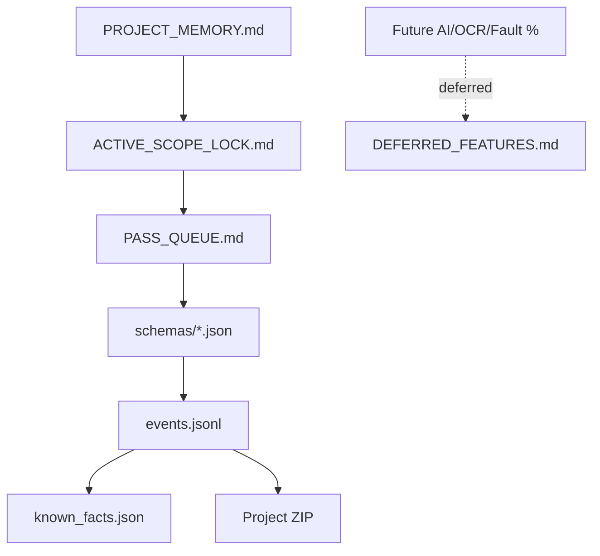

# PROJECT_MINI_MAP.md

```mermaid
flowchart TB
  PM[PROJECT_MEMORY.md] --> ASL[ACTIVE_SCOPE_LOCK.md]
  ASL --> PQ[PASS_QUEUE.md]
  PQ --> SCHEMAS[schemas/*.json]
  SCHEMAS --> EVENTS[events.jsonl]
  EVENTS --> FACTS[known_facts.json]
  EVENTS --> ZIP[Project ZIP]

  FUTURE[Future AI/OCR/Fault %] -.deferred.-> DF[DEFERRED_FEATURES.md]
```

Fast rule: if a task opens AI/OCR/fault probability/source search, stop and defer.
